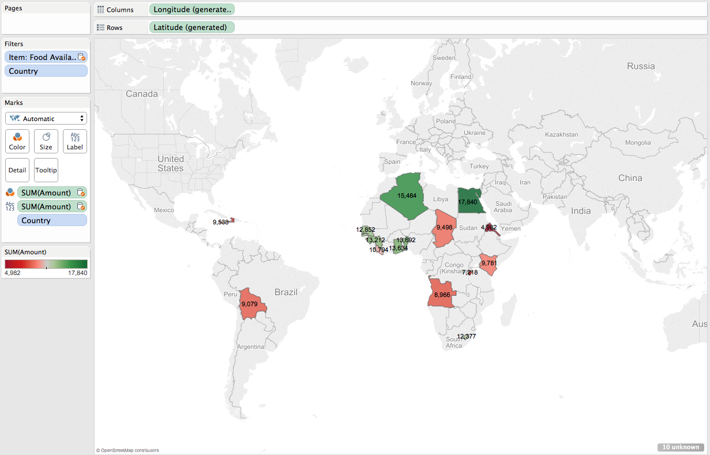

Tableau Project 3
====
**Group members: Fabiana Latorre, Oliver Benton Javier, Ernesto Canales, and Nikolaj Plagborg-Moller.**  

Our datasets can be found at 'http://catalog.data.gov/dataset/international-food-security' (Food Security data set) and 'http://data.un.org/Data.aspx?q=GNI+Country&d=SOWC&f=inID%3a94' (Gross National Income data set). The two sets both have an attribute named 'Country', which provides the link that we use to blend the two sources for our visualizations. Since the GNI data set only includes the year 2011, our visualizations only deal with that year.
  
**Pie Diagram**

The size of the slices in the pie diagram indicate how big each country's gross national income (from the GNI data set) is compared to the other countries'. We gave each country its own color and added labels stating the name and population of that country (from the Food Security data set) given in millions. It is very interesting that, of these developing countries, Jamaica has the largest gross national income yet one of the smallest populations.
  
  
**Scatter Plot**

The scatter plot shows gross domestic product (from the Food Security data set) on the y-axis and gross national income (from the GNI data set) on the x-axis. We filtered Egypt and India out because they stuck out too much from the rest of the countries. 
We can see a positive linear correlation between GNI and GDP on this graph, and it was interesting to find that Jamaica has the highest GNI and the lowest GDP.
  
  
**Bar Graph**
  

The bar graph illustrates the quantity of food exported and quantity of food imported (from the Food Security data set), both with unit 1000 MT, for each country. Orange color denotes export, whereas brown is import, and the height of the bars is the combined amount of food going either in or out of each country. The width of each bar correlates with the country’s GNI (from the GNI data set), so the thinnest bar has the lowest GNI, and the thickest has the largest GNI. It is interesting to see that the import of food far outweighs the export for all these developing countries.

  
**GNI vs Grain**
  

  
This horizontal bar graph shows GNI values (from the GNI data set) in relation to the production, import, and export food quantities (from the Food Security data set) of seven countries. We used various filters to narrow down the criteria, choosing each country, commodity, and item respectively. Each color denotes an item type and the length of the bars indicate the amount. From the data, we concluded that Kenya has surprisingly high production and import quantities, despite it's low GNI value. Across all the countries, there are relatively more imports than exports.

**World Maps**

We did a little extra work, so below we show two world maps. One was created using the values of food availability per capita from our Food Security data set. The other one uses a calculated field with the formula: SUM([Value])/SUM([FOODSECURITY (C##CS329E_NP6593)].[Amount]), where 'SUM([Value])' denotes GNI. The field thereby draws on values from both data sets, and gives us the GNI per capita. We filtered out some countries like India, Georgia, and Jamaica, which we considered to be outliers.

**Food Availability per Capita (in kg/cap)**

**Gross National Income per Capita (in thousand $USD/cap)**

We conclude that the wealth of a country does not always correlate with food availability for citizens. In Egypt, interestingly enough, the opposite was true; low GNI per capita and high Food Availability per capita.

One final comment is that we in our Tableau workbook have repeated data sources since we worked on many computers, and whenever we imported a worksheet from one computer to another, it also added repetitions of the data sources.

- The End